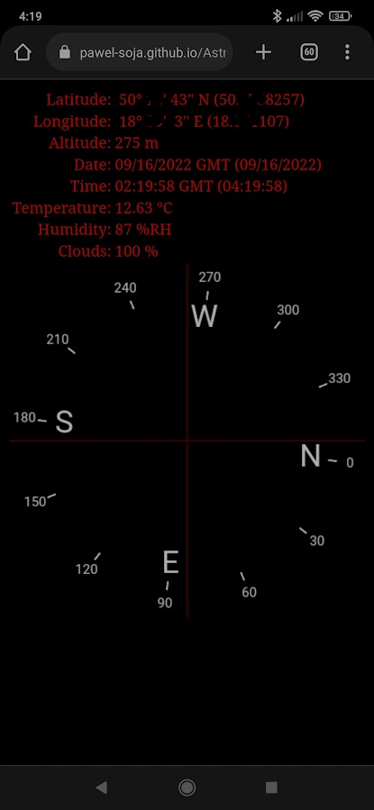

# AstroTool
A little setup assistant for aligning your telescope.

Features:
- Your geographic position
- Height above sea level
- Local time and GMT
- Current temperature, humidity, cloudiness
- Compass

The application needs access to the location sensor - works on Android (Chrome)

To run the application, just go to the link: https://pawel-soja.github.io/AstroTool

